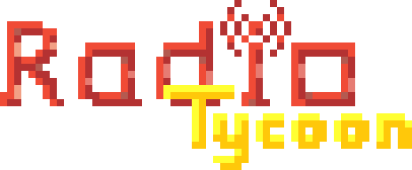
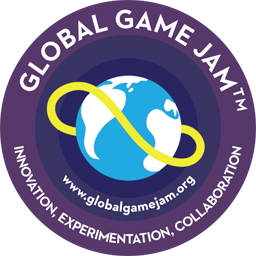

# Development Setup
## 1. Install NPM Packages
Run:

```npm/yarn install```
## 2. Start Development Server
Run:

```npm/yarn run dev```

Game development started on Global GameJam 2018



Special Thanks to lean's boilerplate project: [phaser-es6-webpack](https://github.com/lean/phaser-es6-webpack)
